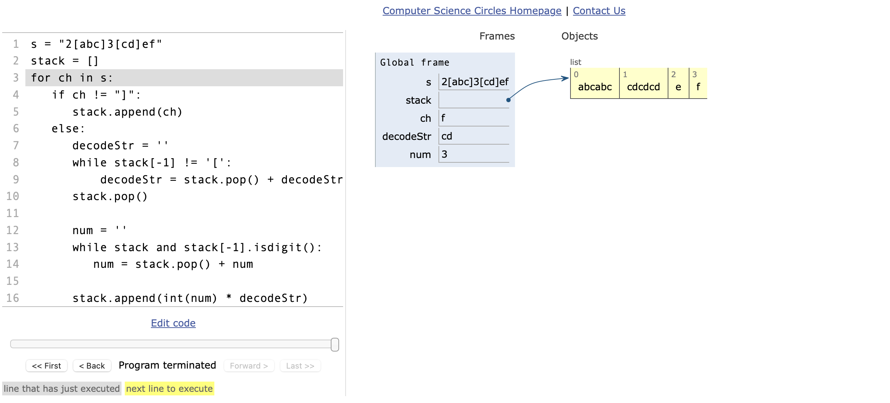

- **Problem Link** : [LeetCode 394 - Decode String](https://leetcode.com/problems/decode-string/description/)
- **Date** : 8th July, 2025
- **Topic** : [[String]], [[Stack]]
- **Difficulty** : #medium

---
### Summary Description: 
- Given a string in a coded form, like 3[a] = 'aaa'
- `3[a2[bc]] = abcbc-abcbc-abcbc`
- `3[a]2[bc] = aaa-bcbc`
 
## Strategy & Key Insights
 - Using a stack.
 - Append all the element to the stack if not the *closed Bracket*.
 - when we found a close bracket - means a string ended. so we have to decode the string with the num
   - Decode the string till as backwards by using the top till the time we reach an open bracket
   - So we got the str of one bracket
   - Now we need the number
 - NUM
   - when we reach the open bracket there will be a num
   - num
 


## PseudoCode (Brute-Force)
```
for each char in s:
    if not ']':
        add to stack
    else:
        decode str = ''
        while stack[-1] != '[':
            stack.pop() will give the top of 
        else:
            pop out the [

        initialize num str
        till stack is full top is a number like
            num = stack.pop() + num
        stack add int(num) * decode str
```

## Dry Run and Visualization


- Vizualization Link: (https://cscircles.cemc.uwaterloo.ca/visualize#mode=display)
- Visualize code: [CodeChef](https://www.codechef.com/code-visualizer/8eb0b2d74c34fcdacbbc40e29e9c2200)
- Will also give the answer why the join method is needed


