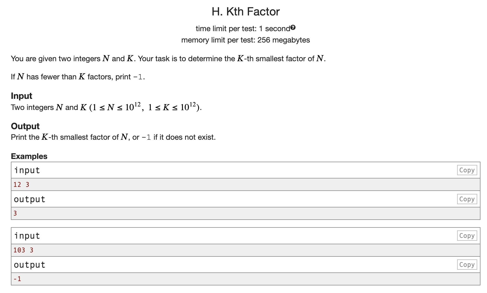

Link: https://codeforces.com/group/4vcXCPx8NY/contest/676977/problem/H
Solution: [K-th Factor](returnK-thFactor.py)

## Brute
- run a O(n) loop store the factors and return the k-th
  - But O(N) TC won't be accepted here since $n <= 10^12$

## Better
- Run a loop till $\sqrt{n}$, $ d \in [1, \sqrt{n}]$, store the factors as ${d}$ and $n//d$
- Sort the factors array
- return the k-th factor
- TC: O$(\sqrt{n} + m \log_{2} m)$
- SC: O(m)

## Optimal
- TC: O$(\sqrt{n})$
- SC: O(1)
- Run the first half the loop in forward, let for n == 12; store the factors d, as 1, 2, 3
- Then run a second O$(\sqrt{n})$ loop in backward order from, $d \in [\sqrt{n}, 1]$ and the factors will be $n//d$.
- Don't store the factors but keep a counter; when counter reach k return d if in the first loop or n//d if in the second loop


# Number of Common Factors — Complete Notes

---

## Problem

Given two integers `a` and `b`, return the number of integers that divide **both** `a` and `b`.

https://leetcode.com/problems/number-of-common-factors/description/ - also added my solution in article

---

# Core Mathematical Insight

### Key Identity

> Common factors of `a` and `b` = Factors of `gcd(a, b)`

### Why this is true

Let:

* `d` divides both `a` and `b`

Then:

* `d` must divide `gcd(a, b)`

Conversely:

* Any divisor of `gcd(a, b)` divides both `a` and `b`
Therefore:

```
CommonFactors(a, b) = NumberOfDivisors(gcd(a, b))
```

---

# Approach 1: Brute Force

## Idea

Check every number from `1` to `min(a, b)`.

## Code

```python
for i in range(1, min(a, b)+1):
    if a % i == 0 and b % i == 0:
        count += 1
```

## Complexity

* Time: `O(min(a, b))`
* Space: `O(1)`

## Verdict

Inefficient for large inputs

---

# Approach 2: √n Optimization (Your Approach)

## Idea

* Iterate up to `√a`
* Use divisor pairs `(d, a//d)`

---

## Correct Code Pattern

```python
for d in range(1, int(a**0.5)+1):
    if a % d == 0:
        if b % d == 0:
            count += 1

        if d != a//d and b % (a//d) == 0:
            count += 1
```

---

## Critical Edge Cases

### 1. Perfect Square

If:

```
d * d == a
```

Then:

* `d` and `a//d` are SAME
* Must count only once

---

### 2. Independent Checking of Pair

For divisor pair `(d, a//d)`:

* `d` may divide `b`
* `a//d` may divide `b`

They must be checked **independently**

---

### 3. Common Mistake (Important)

Wrong:

```python
if a%d == 0 and b%d == 0:
    # then check a//d
```

This skips valid cases where:

* `d` does NOT divide `b`
* but `a//d` DOES

---

## Complexity

* Time: `O(√min(a, b))`
* Space: `O(1)`

## Verdict

Good, but not optimal

---

# Approach 3: Optimal (GCD + Divisor Count)

## Idea

1. Compute `g = gcd(a, b)`
2. Count divisors of `g`

---

## Code

```python
from math import gcd

class Solution:
    def commonFactors(self, a: int, b: int) -> int:
        n = gcd(a, b)

        root = int(n**0.5)
        count = 0

        for d in range(1, root + 1):
            if n % d == 0:
                count += 2
                if d * d == n:
                    count -= 1

        return count
```

---

## Why This Works

* All common divisors collapse into one number → `gcd`
* Now problem reduces to:

```
Count divisors of n
```

---

## Divisor Counting Logic

If `d` divides `n`:

```
(d, n//d) → divisor pair
```

* Count both → `+2`
* If perfect square → subtract 1

---

## Complexity

* GCD: `O(log(min(a, b)))`
* Divisor count: `O(√g)`

### Total:

```
O(log(min(a, b)) + √g)
```

---

## Comparison Summary

| Approach    | Time Complexity | Idea           | Verdict |
| ----------- | --------------- | -------------- | ------- |
| Brute Force | O(min(a,b))     | Check all      | ❌ Bad   |
| √n Method   | O(√min(a,b))    | Divisor pairs  | ✅ Good  |
| GCD + √g    | O(log n + √g)   | Reduce + count | 🚀 Best |

---

## Key Takeaways

1. Always look for **mathematical reduction**
2. GCD is a **powerful tool** in number theory
3. Divisor problems → think in **pairs**
4. Never gate one divisor using another

---

## What to Learn Next

* Extended Euclidean Algorithm
* LCM using GCD
* Prime factorization divisor formula

---

## Final Insight

> Strong problem solvers don’t iterate — they reduce the problem size first.

