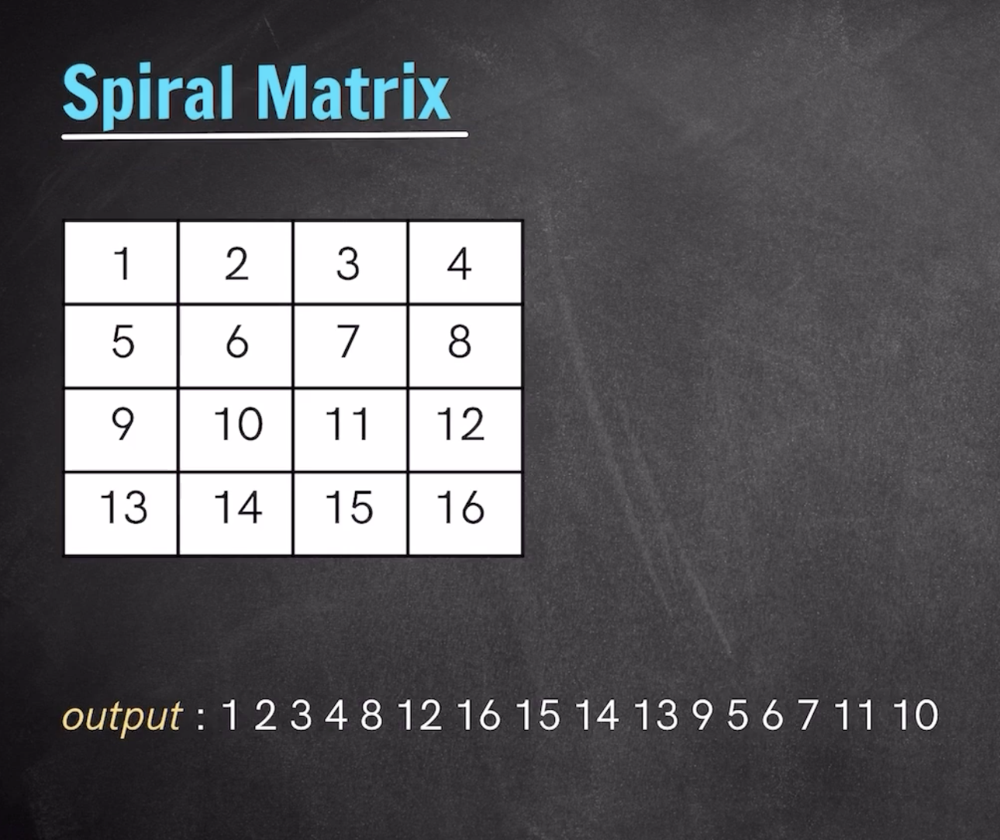

# [Spiral Matrix](/2d-arrays/01-spiral-matrix.py)
 

  

- Have 4 vars, srow, erow, scol, ecol.
- Travel top -> right -> bottom -> left
- And repeat this boundary travel till we reach the mid point

Here are the essential revision notes for the **Spiral Matrix** problem. This is a classic "Simulation" problem that tests your ability to manage boundaries and edge cases.

### 🧩 Core Logic: The "Shrinking Box"

The strategy is to maintain four boundaries that represent the current "shell" of the matrix you are traversing. After each side of the shell is completed, you shrink that boundary inward.

* **`srow` (Starting Row):** Top boundary. Increases after a Left $\rightarrow$ Right pass.
* **`erow` (Ending Row):** Bottom boundary. Decreases after a Right $\rightarrow$ Left pass.
* **`scol` (Starting Column):** Left boundary. Increases after a Bottom $\rightarrow$ Top pass.
* **`ecol` (Ending Column):** Right boundary. Decreases after a Top $\rightarrow$ Bottom pass.

### ⚠️ Critical Implementation Details

* **The `while` Condition:** Use `(srow <= erow) and (scol <= ecol)`. The loop must stop the moment the boundaries cross in *either* direction.
* **The "Middle Row/Col" Guard:** * Inside the loop, the `srow` or `ecol` values change **immediately** after their respective loops.
* For the **Bottom** and **Left** passes, you *must* wrap them in an `if` check (e.g., `if srow <= erow`) to ensure you aren't re-processing a row or column that was already finished by the "Top" or "Right" passes in that same iteration.

### ⏱️ Complexity Analysis

* **Time Complexity:** $O(N \times M)$, where $N$ and $M$ are the dimensions of the matrix. Every element is visited exactly once.
* **Space Complexity:** $O(1)$ (excluding the space required for the output list), as we only store four boundary variables regardless of matrix size.

### 💡 Pro-Tip for Interviews

If the interviewer asks to do it **in-place** or without an extra `arr` list, remind them that the spiral order isn't a standard memory layout, so you usually *have* to return a new list or print the elements as you go.
